# Success Motors Uganda

Flutter mobile application for **Success Motors** – your trusted car dealership in Kampala, Uganda.

Buy, rent, finance, service, and explore vehicles with ease.

## Features

- Browse premium imported vehicles
- Success Pay flexible installment plans
- Online garage booking & professional car services
- Self-drive & chauffeured car rentals
- Secure user authentication & profile management
- Real-time order tracking & live chat support
- Full admin panel for managing products, orders, rentals, loans, bookings & support

### Customer Experience Highlights
- Animated splash screen with custom geometric "G" logo
- Video welcome screen (W1.mp4 loop + controls)
- Smooth onboarding flow
- Email verification + strong password rules
- Uganda phone number input
- Home screen with search, categories, quick access to Rentals / Loans / Garage
- Product browsing with brand logos, detailed view, wishlist, cart & checkout
- Order history, tracking timeline & notifications
- Live chat with typing indicators & read receipts
- Profile (personal info, delivery address, payment methods, help & feedback)

### Rentals
- Browse fleet → booking (dates, location, driver option) → review → confirmation → my rentals

### Car Loans (Success Pay)
- Multi-step application → document upload → review → repayment schedule → my loans + calculator

### Garage Services
- Book service → review → confirmation → my bookings

### Admin Panel
- Dashboard grid
- Manage products, rental cars, categories
- Orders (status + delivery assignment)
- Garage & rental bookings
- Loan applications (review/approve/reject)
- Live chat console
- Statistics & promotions
- Real-time tracking map

## Screenshots

  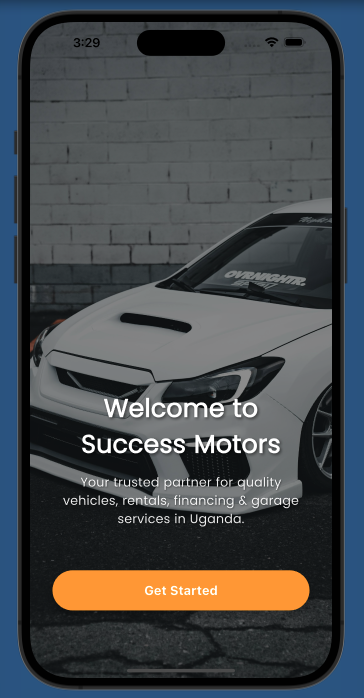
  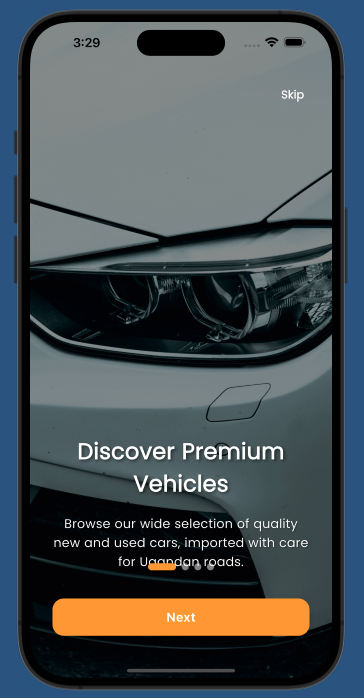
  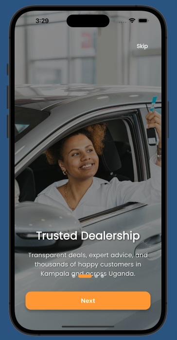
  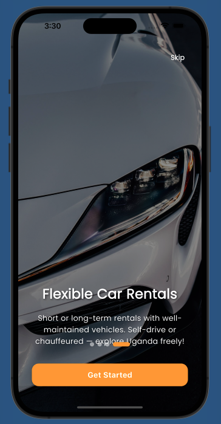
  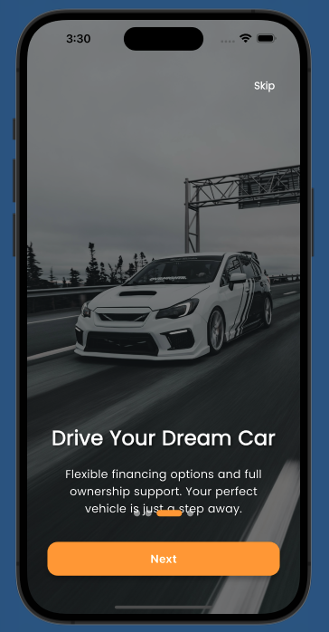
  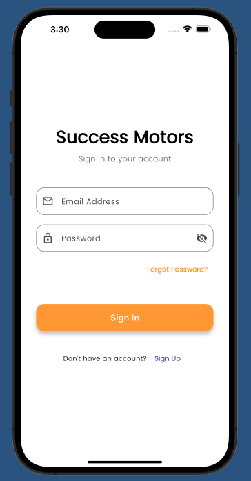
  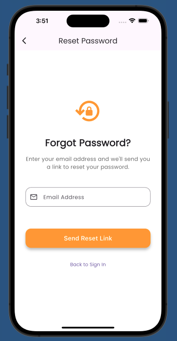
  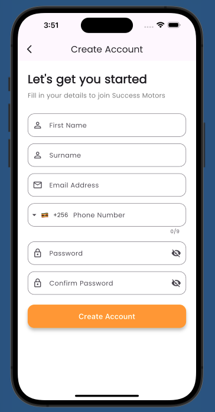
  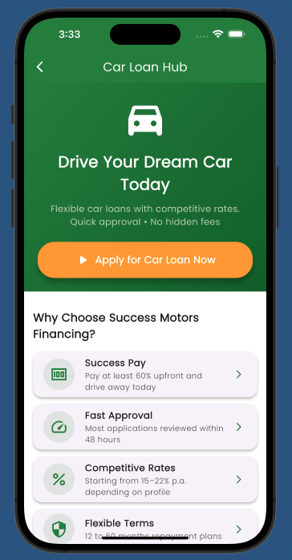
  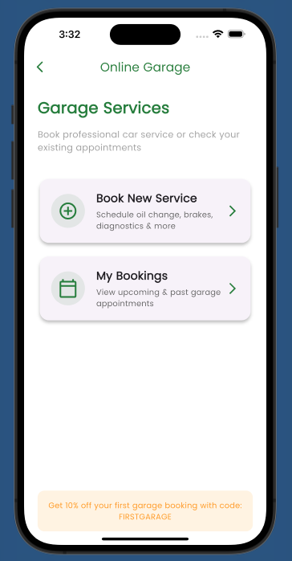
  
 
  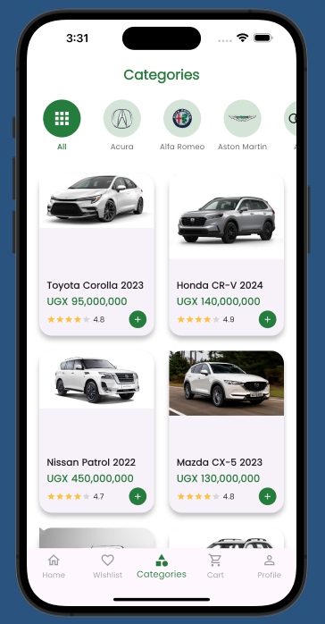
  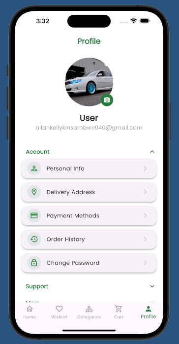
  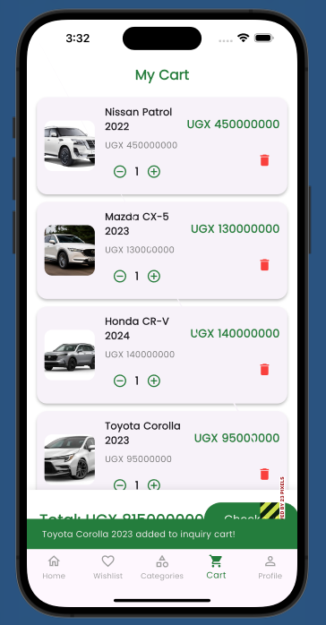
  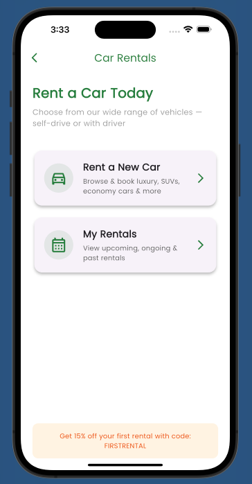
  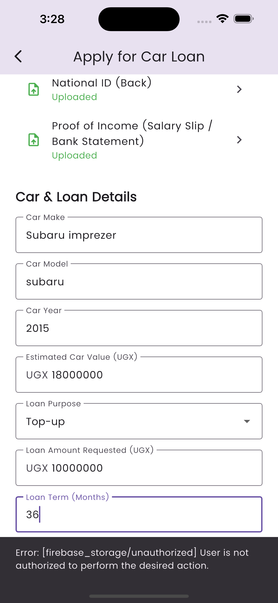
  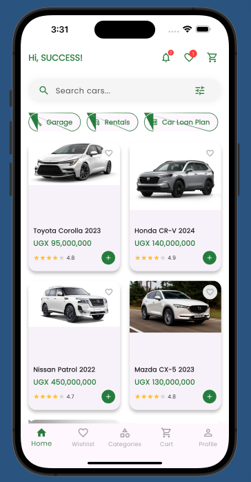
  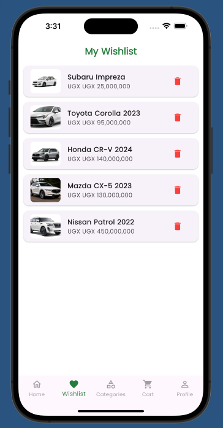
  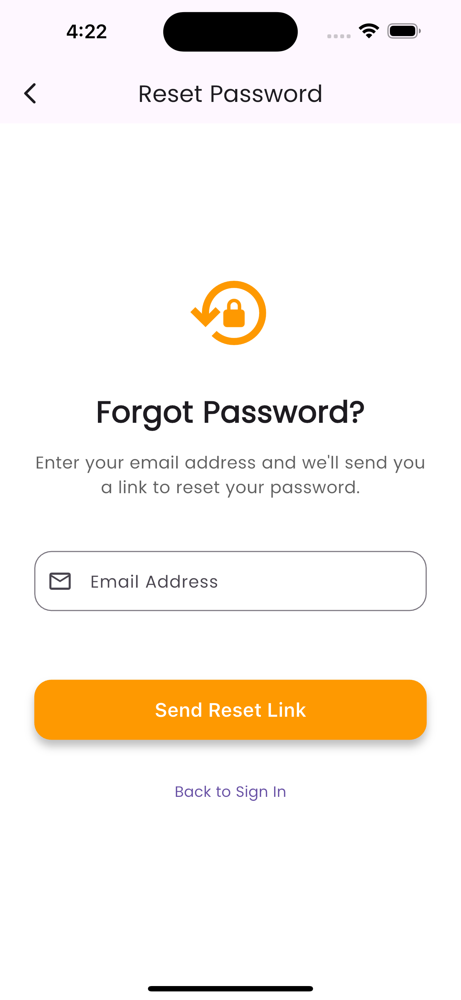

  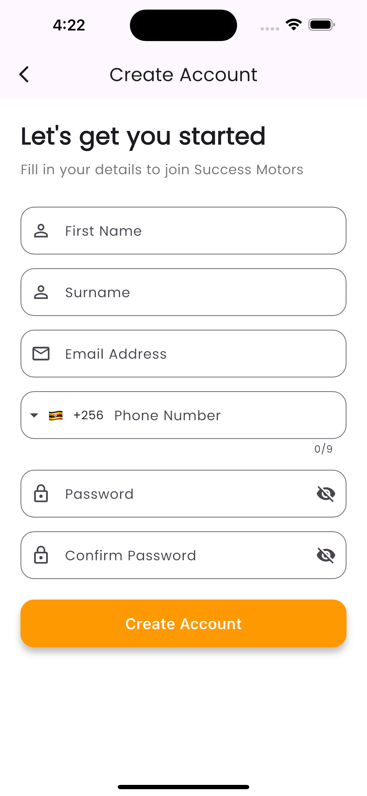
  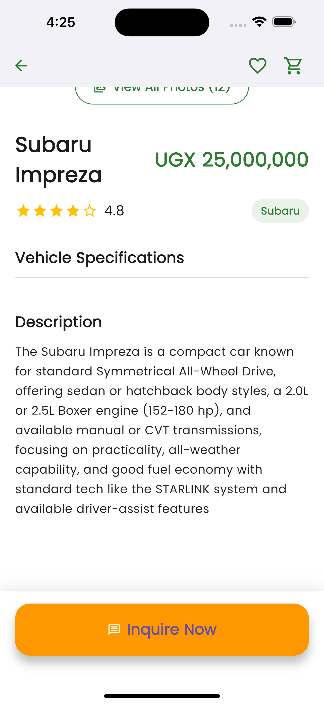
  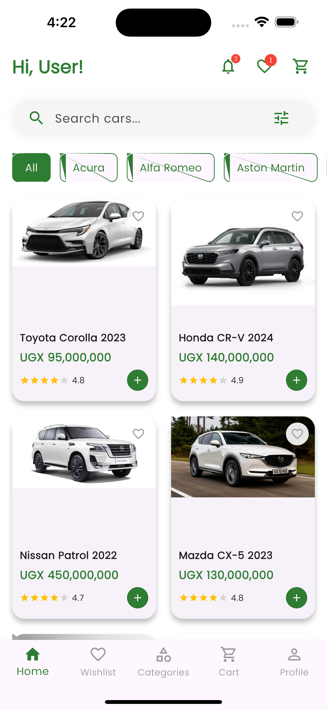

  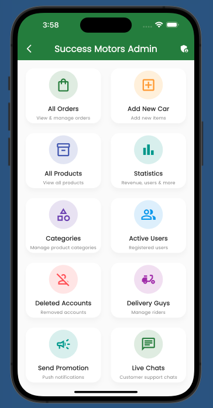
  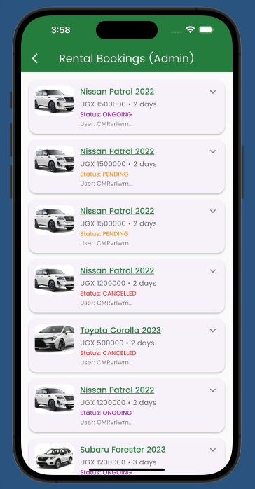
  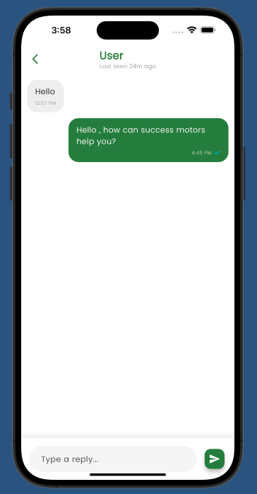

**Screen Recording**  
Full high-quality walkthrough of customer + admin flows (original sharp version, ~157 MB):

  <iframe src="https://drive.google.com/file/d/1STAjQR5u3myEsB2GSC-7BYArzdTxpP8g/preview" 
          width="80%" 
          height="480" 
          allow="autoplay; fullscreen" 
          allowfullscreen></iframe> 
  Full quality preserved – hosted on Google Drive. Plays in most browsers (may buffer on slow connections).

## Tech Stack

- Flutter (Dart) + Material 3 design
- Firebase Authentication, Firestore, Storage
- Video Player (welcome screen)
- Google Maps (live tracking)
- Packages: google_fonts (Poppins), smooth_page_indicator, intl_phone_field, image_picker, confetti, share_plus, geolocator, etc.
- Java 17 for Android builds

## Setup & Run

# Clone the repo
git clone https://github.com/Allan-KellyKinsambwe/success-motors.git
cd success-motors

# Install dependencies
flutter pub get

# (Recommended) Configure Firebase for your project
flutterfire configure

# Run on device or emulator
flutter run

**FIREBASE RULES**
**Firestore**
rules_version = '2';

service cloud.firestore {
  match /databases/{database}/documents {

    // ────────────────────────────────────────────────
    // Helper: Check if current user is admin
    // ────────────────────────────────────────────────
    function isAdmin() {
      return request.auth != null &&
             exists(/databases/$(database)/documents/users/$(request.auth.uid)) &&
             get(/databases/$(database)/documents/users/$(request.auth.uid)).data.isAdmin == true;
    }

    // ────────────────────────────────────────────────
    // USERS collection
    // ────────────────────────────────────────────────
    match /users/{userId} {
      allow read: if request.auth != null;                    // logged-in users can read any profile (common pattern)
      allow write: if request.auth != null && request.auth.uid == userId;
      // Suggestion: consider allow update only (not create/delete) if profiles are created at signup
    }

    // ────────────────────────────────────────────────
    // ORDERS
    // ────────────────────────────────────────────────
    match /orders/{orderId} {
      allow read: if request.auth != null &&
                   (resource.data.user_id == request.auth.uid || isAdmin());

      allow list: if request.auth != null &&
                   (isAdmin() ||
                    ('user_id' in request.query.where &&
                     request.query.where.user_id == request.auth.uid));

      allow create: if request.auth != null &&
                     request.resource.data.user_id == request.auth.uid &&
                     request.resource.data.createdAt is timestamp;

      allow update, delete: if isAdmin();
    }

    // ────────────────────────────────────────────────
    // GARAGE BOOKINGS
    // ────────────────────────────────────────────────
    match /garage_bookings/{bookingId} {
      allow read, list: if request.auth != null &&
                        resource.data.userId == request.auth.uid;

      allow create: if request.auth != null &&
                     request.resource.data.userId == request.auth.uid &&
                     request.resource.data.keys().hasAll([
                       'userId', 'fullName', 'phoneNumber', 'carMake', 'carModel',
                       'carYear', 'registrationNumber', 'serviceType',
                       'preferredDate', 'preferredTime', 'createdAt'
                     ]);

      allow update: if request.auth != null && resource.data.userId == request.auth.uid;
      allow delete: if isAdmin();

      // Admin full access
      allow read, write, list, create, update, delete: if isAdmin();
    }

    // ────────────────────────────────────────────────
    // RENTAL BOOKINGS
    // ────────────────────────────────────────────────
    match /rental_bookings/{bookingId} {
      allow read, list: if request.auth != null &&
                        resource.data.userId == request.auth.uid;

      allow create: if request.auth != null &&
                     request.resource.data.userId == request.auth.uid &&
                     request.resource.data.keys().hasAll([
                       'userId', 'carMake', 'carModel', 'carImage',
                       'dailyRate', 'pickupDate', 'dropoffDate',
                       'pickupLocation', 'dropoffLocation', 'withDriver',
                       'totalAmount', 'status', 'createdAt'
                     ]);

      allow update: if request.auth != null && resource.data.userId == request.auth.uid;
      allow delete: if isAdmin();

      // Admin full access
      allow read, write, list, create, update, delete: if isAdmin();
    }

    // ────────────────────────────────────────────────
    // PRODUCTS & CATEGORIES (public read)
    // ────────────────────────────────────────────────
    match /{path=**}/products/{doc} {
      allow read: if true;
      allow write: if isAdmin();
    }

    match /{path=**}/categories/{doc} {
      allow read: if true;
      allow write: if isAdmin();
    }

    // ────────────────────────────────────────────────
    // NOTIFICATIONS (user-specific)
    // ────────────────────────────────────────────────
    match /notifications/{notifId} {
      allow read, list: if request.auth != null &&
                         resource.data.userId == request.auth.uid;

      allow create: if isAdmin();
      allow update: if request.auth != null && resource.data.userId == request.auth.uid;
    }

    // ────────────────────────────────────────────────
    // PROMOTIONS (broadcast from admin)
    // ────────────────────────────────────────────────
    match /promotions/{promoId} {
      allow create: if isAdmin();
      allow read: if request.auth != null;
    }

    // ────────────────────────────────────────────────
    // DELIVERY GUYS (admin only)
    // ────────────────────────────────────────────────
    match /delivery_guys/{doc} {
      allow read, write: if isAdmin();
    }

    // ────────────────────────────────────────────────
    // LIVE CHAT SUPPORT (very strict rules)
    // ────────────────────────────────────────────────
    match /live_chats/{chatId} {
      // Only support chats following pattern support_chat_{uid}
      allow list: if isAdmin();

      allow read, write: if request.auth != null &&
                           chatId.matches('support_chat_.*') &&
                           (chatId == 'support_chat_' + request.auth.uid || isAdmin());

      match /messages/{messageId} {
        allow read: if request.auth != null &&
                       (chatId == 'support_chat_' + request.auth.uid || isAdmin());

        allow create: if request.auth != null &&
                         (chatId == 'support_chat_' + request.auth.uid || isAdmin()) &&
                         request.resource.data.keys().hasAll(['text', 'userName', 'isSupport', 'timestamp']) &&
                         request.resource.data.text is string &&
                         request.resource.data.userName is string &&
                         request.resource.data.isSupport is bool &&
                         request.resource.data.timestamp is timestamp &&
                         (
                           // Customer message
                           (chatId == 'support_chat_' + request.auth.uid &&
                            request.resource.data.isSupport == false &&
                            request.resource.data.userId == request.auth.uid)
                           ||
                           // Admin/support message
                           (isAdmin() && request.resource.data.isSupport == true)
                         );

        allow update: if request.auth != null &&
                         (chatId == 'support_chat_' + request.auth.uid || isAdmin()) &&
                         request.resource.data.diff(resource.data).affectedKeys().hasOnly(['read']) &&
                         request.resource.data.read == true;

        allow delete: if false;  // never allow delete
      }
    }

    // ────────────────────────────────────────────────
    // RENTAL CARS (public read)
    // ────────────────────────────────────────────────
    match /rental_cars/{carId} {
      allow read: if true;
      allow create, update, delete: if isAdmin();
    }

    // ────────────────────────────────────────────────
    // LOAN APPLICATIONS (tight control – users create, admins manage)
    // ────────────────────────────────────────────────
    match /loan_applications/{applicationId} {
      allow create: if request.auth != null
                    && request.resource.data.userId == request.auth.uid
                    && request.resource.data.createdAt is timestamp
                    && request.resource.data.status == 'pending'
                    && "firstName" in request.resource.data
                    && "surname" in request.resource.data
                    && "email" in request.resource.data
                    && "phoneNumber" in request.resource.data
                    && "nationalId" in request.resource.data;

      allow read: if request.auth != null &&
                   (resource.data.userId == request.auth.uid || isAdmin());

      allow list: if request.auth != null &&
                   (
                     ('userId' in request.query.where &&
                      request.query.where.userId == request.auth.uid) ||
                     isAdmin()
                   );

      allow update: if isAdmin();     // only admins can approve/reject/add notes/change status
      allow delete: if isAdmin();
    }
  }
}

**Storage**
rules_version = '2';

service firebase.storage {
  match /b/{bucket}/o {

    // ────────────────────────────────────────────────
    // Profile pictures – users manage their own
    // ────────────────────────────────────────────────
    match /profile_pictures/{userId}/{allPaths=**} {
      allow read: if true;
      allow write: if request.auth != null
                    && request.auth.uid == userId
                    && request.resource.size < 10 * 1024 * 1024   // 10 MB
                    && request.resource.contentType.matches('image/.*');
    }

    // ────────────────────────────────────────────────
    // Product & Rental car images – public read, admin write
    // ────────────────────────────────────────────────
    match /products/{allPaths=**} {
      allow read: if true;
      allow write: if request.auth != null
                    && get(/databases/$(default)/documents/users/$(request.auth.uid)).data.isAdmin == true
                    && request.resource.size < 10 * 1024 * 1024
                    && request.resource.contentType.matches('image/.*');
    }

    // ────────────────────────────────────────────────
    // Loan application documents – strictly user-owned
    // ────────────────────────────────────────────────
    match /loan_docs/{userId}/{allPaths=**} {
      allow read: if request.auth != null && request.auth.uid == userId;
      allow write: if request.auth != null
                    && request.auth.uid == userId
                    && request.resource.size < 8 * 1024 * 1024     // 8 MB – stricter limit
                    && request.resource.contentType.matches('image/.*');
    }

    // ────────────────────────────────────────────────
    // Deny everything else by default (important!)
    // ────────────────────────────────────────────────
    match /{allPaths=**} {
      allow read, write: if false;
    }
  }
}

**PROJECT STRUCTURE**
lib/
├── auth/                     # splash, welcome, onboarding, login, signup, email verification
├── screens/
│   ├── home_screen.dart
│   ├── category_screen.dart
│   ├── product_detail_screen.dart
│   ├── cart_screen.dart
│   ├── checkout_screen.dart
│   ├── profile/              # personal_info, delivery_address, payment_methods, order_history...
│   ├── rentals_cars/         # rental list, booking, review, confirmation, schedule, details
│   ├── loan_cars/            # application, review, confirmation, schedule, my_loans, calculator, faq
│   └── garage_cars/          # hub, booking, review, confirmation, schedule
├── admin/                    # admin_panel, products, rentals, loans, chats, statistics, tracking...
├── models/                   # product_model, rental_model, garage_model, loan_model
├── constants/                # colors, styles, category_logos
├── services/                 # location_service
└── main.dart

**📞 CONTACT & SUPPORT**
SWIFT APP CRAFTING
Kampala
Phone: +256 750 467 976| +256 775 397 488

Follow on TikTok: @swiftappcrafting
Swift App Crafting
https://www.tiktok.com/@swiftappcrafting?is_from_webapp=1&sender_device=pc

## Contributors

Thanks goes to these wonderful people:

<table>
  <tr>
    <td align="center">
      <a href="https://github.com/Allan-KellyKinsambwe">
        
         
        <b>Allan Kelly Kinsambwe</b>
      </a>
       
      Maintainer & Lead Developer
    </td>
  </tr>
</table>

Want to contribute? Feel free to open issues, submit pull requests, or reach out!

Made with ❤️ in Kampala, Uganda
© 2026 Swift App Crafting